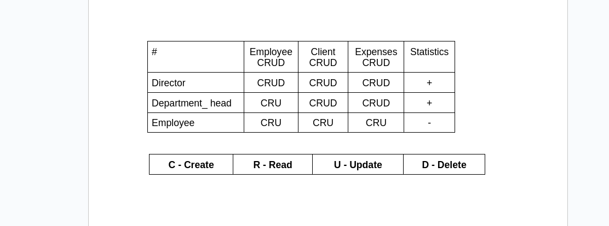

Http methods va JPA  mavzulari uchun amaliy vazifa

Vazifaning qo’yilishi: Vazifangiz bir kichik korxonaning elektron hisobini yuritish uchun tizim ishlab chiqishingiz kerak. Korxonaning tarkibida xodimlarni boshqarish bo’limi, hamda mijozlar bilan ishlash bo’limlari mavjud. Ammo korxona rejasida yangi bo’limlar ochilishi ko’zda tutilgan. Ushbu vazifada xodimlarni boshqarish bo’limi uchun, tizimning bir bo’lagini ishlab chiqing. Ya’ni xodimlarni korxona tarkibiga qo’shish, ularni ma’lumotlarini tahrirlash, har bir xodim haqida to’liq ma’lumotni olish, hamda xodimni ishdan olish kabi imkoniyatlarini  yaratib bering.
Xodimlar to’g’risida quyidagi ma’lumotlar saqlanishi shart: Ismi, familiyasi, sharifi, yoshi,
passport ma’lumotlari( seriyasi, raqami, JSHSHIR, millati), ish haqi, yashash manzili, Bo’limi (korxona tarkibidagi bo’limlardan biri).
Korxonada xodimlar quyidagi lavozimlar asosida taqsimlanadi: Direktor, bo’lim boshlig’i, xodim.

Vazifaning qo’yilishi: Bu galgi vazifada korxonaning mijozlar bilan ishlash bo’limi uchun tizimning bir bo’lagini ishlab chiqishingiz zarur. Korxonaning mijozlar bilan ishlash bo’limining ish  jarayoni quyidagicha: Mijoz korxonaga tashrif buyurganda, korxonaning mijozlar bilan ishlash bo’limi xodimi bilan uchrashadi, xodim mijozning kerakli ma’lumotlarini(ismi, familiyasi, passport seriya, passport raqam, JSHSHIR, yashash manzili, hamda joriy sana+vaqt)) tizimga o’z akkounti orqali saqlab qo’yadi. Korxonaning mijozlar bilan ishlash bo’limi xodimlariga quyidagi imkoniyatlar yaratilishi kerak: Mijozni ro’yxatdan o’tkazish, tahrirlash, mijoz haqida batafsil ma’lumot olish, Mijozni arxiv bo’limiga o’tkazish, har bir xodim o’zi ro’yxatdan o’tkazgan mijozlarini ko’rish.

Vazifaning qo’yilishi: Korxona biroz kengaydi. Korxona tarkibiga sotuv bo’limi qo’shildi. Sotuv bo’limidagi xodimlar asosan korxona xizmatlarini sotish bilan shug’ullanishadi. Ular ijtimoiy tarmoqlar, televideniya, bannerlar orqali korxonaning sotuv darajasini oshirish bilan shug’ullanadi. Ularni qog’ozbozlikka vaqtlari yo’qligi sababli ularga ham sizning yordamingiz kerak bo’lmoqda. Vazifa shundan iboratki, sotuv bo’limidagi hodimlar o’z harajatlarini yozib borishi kerak. Ularning yozadigan ma’lumotlari asosan reklama_turi(Instagram ads yoki Google ads (Ixtiyoriy)), reklama xarajati, reklama muddati, reklama boshlangan sana+vaqt, reklamani kiritgan xodim. Ushbu ma’lumotlarni tahrirlash jarayoni mantiqan o’ylab chiqilsin (qaysi maydonlar o’zgartirilishi mumkun yoki mumkun emasligi).
Xodimlar ushbu ma’lumotlarning har birini va hammasini(jadval shaklida) ko’rish imkoniyati yaratilsin. Ma’lumotlar ko’paysa, ma’lumotlarni hammasini birdan emas, sahifalab(Pagination) olish imkoniyati qo’shilsin.

Vazifaning qo’yilishi: Korxona direktori uchun alohida statistikalar kerak bo’lib qoldi.
Hodimlar haqida quyidagi statistikalar kerak bo’ladi:
1. Bo’limlar kesimida korxona xodimlar soni. (Har bir bo’limda nechtadan xodim ishlayotganligini son hamda foiz orqali ifodasi).
2. Xodimlarini yosh bo’yicha filterlash.
3. Barcha hodimlar jadvalini pagination bilan chiqarish.
4. Xodimlarni maoshlarining umumiy summalarini topish.

Vazifaning qo’yilishi: Korxona direktori uchun alohida statistikalar kerak bo’lib qoldi.
Mijozlar haqida quyidagi statistikalar kerak bo’ladi:
1. Kunlik ro’yxatdan o’tgan mijozlar soni.
2. Mijzolar bilan ishlash bo’limining xodimlaridan qaysi biri eng ko’p mijoz ro’yxatdan o’tkazgan ?.
3. Eng ko’p mijoz ro’yxatdan o’tkazgan top 3 ta xodim.
4. So’ngi 1 oyda nechta mijoz ro’yxatdan o’tgan.
5. So’nggi 1 oyning qaysi kunida eng ko’p mijoz ro’yxatdan o’tgan

Vazifaning qo’yilishi: Korxona direktori uchun alohida statistikalar kerak bo’lib qoldi.
Sotuv bo’limi uchun quyidagi statistikalar kerak bo’ladi:
1. Eng ko’p reklama xarajatlari qaysi reklama turiga mansub?
2. Qaysi xodim eng ko’p reklama xarajatlarini kiritgan ?
3. Oxirgi 1 oy ichida nechta reklama yo’lga qo’yilgan ?
4. Oxirgi 1 oy ichida nechta reklama to’xtagan ?
5. Har bir reklama turiga nechtadan reklama xarajatlari to’g’ri keladi ?

Vazifaning qo’yilishi: Korxona direktori tizim xavfsizligini yo’lga qo’yish kerakligini hamda tizimdagi imkoniyatlar lavozim bo’yicha taqsimlanishi kerakligini aytdi. Sizning vazifangiz, tizimga xavfsizlik qismlarini qo’shish hamda imkoniyatlarni lavozim bo’yicha taqsimlashingiz kerak bo’ladi.
Quyidagilarni bajaring:
1) 1-amaliy vazifada berilgan lavozimlar bo’yicha hamda quyidagi matritsa bo’yicha xodimlarni qanday imkoniyatlardan foydalana oladi yoki foydalana olmaydi kabi guruhlarga bo’lib chiqing.
2) Xodimlar lavozimi bo’yicha o’ziga ruxsat berilgan ishlarni bajarishga ruxsati bo’lishi kerak. Ruxsati yo’q ishlarni qilmoqchi bo’lsa bu haqida habarnoma chiqishi kerak.

Vazifaning qo’yilishi: Korxona direktorining yana bir talabi shundan iboratki, tizimda har bir bajarilgan amallar qaydlar varoqasiga qayd qilinib borishi kerak ekan. Sizning vazifangiz tizimda bajarilgan barcha operatsiyalarni log fayllarga yozib borishingiz kerak.
Faqat bu jarayonda shunday ma’lumotlarni yozib boringki, log ni o’qish orqali tizimda qaysi foydalanuvchi, qayerda (Qaysi jadvalda), qachon, nima ish qildi (Qanday metodlardan foydalandi, qaysi endpointlarga so’rov yubordi, CRUD dan qaysilarini amalga oshirdi va qanday ma’lumtolar ustida ishladi (Misol uchun xodim Jasur degan mijoz qo’shsa, shu mijozning kamida quyidagi ma’lumotlari aks etishi kerak: id ))  kabi informatsiyalarni log filelarga yozib keting.

Quyidagilarga rioya qiling:

OOP prinsiplari.

Validatsiyalar.

Ma’lumotlar bazasi bilan ishlashda JPA dan foydalanish.

 

Javob tariqasida, loyihangizni githubga joylab, link qoldiring!

